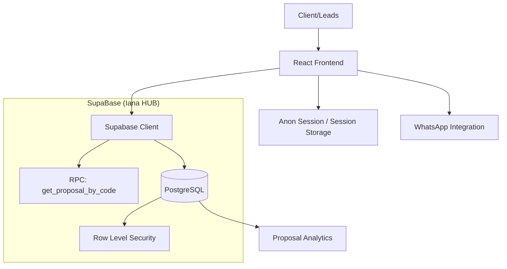

# Arquitetura Técnica - Invoice Unlocker

**Versão:** 1.0.0  
**Status:** Em Desenvolvimento  
**Responsável:** Sofia (CTO)

## 1. Visão Geral
Sistema de apresentação de propostas segura e imersiva. O objetivo técnico é substituir PDFs estáticos por uma Single Page Application (SPA) protegida por um mecanismo de "Unlock" via PIN, com persistência e analytics em tempo real via Supabase.

## 2. Stack Tecnológico
- **Frontend:** React 18 (Vite)
- **Styling:** Tailwind CSS + Framer Motion (Animações Mecânicas)
- **Backend/Database:** Supabase (PostgreSQL + RLS + Edge Functions)
- **Icons:** Phosphor Icons (Duotone)
- **Fontes:** Clash Display (Heading), Satoshi (Body)
- **Deploy:** Vercel

## 3. Diagrama de Arquitetura (Mermaid)

## 4. Modelo de Segurança (Refined v2)
- **Hybrid Unlock Model:**
  - **Public Foundation:** URL baseada em `id` (`/propostas/:slug/:id`) carrega metadados públicos (Nome Cliente, Título, Status) via **RPC Seguro** (`get_proposal_public_metadata`). Não expõe conteúdo sensível.
  - **Private Vault:** O conteúdo estratégico (`content_json`) só é liberado mediante **PIN**, validado via RPC separado (`get_proposal_by_code`).
- **Row Level Security (RLS) & RPC Wrapper:**
  - Acesso direto às tabelas (`SELECT * FROM proposals`) é **bloqueado para anônimos**.
  - O acesso é encapsulado 100% em Stored Procedures (Functions) `SECURITY DEFINER`.
- **Data Integrity:** URLs não contêm mais o segredo (PIN).

## 5. Estratégia de Escalabilidade
- **Serverless Edge:** O uso de Supabase garante que o sistema responda em milissegundos independente da carga geográfica.
- **Low-Payload:** Fetch inicial de `<1kb` (apenas metadados). Payload pesado (`content_json`) on-demand.
- **Indexing:** Índices em `id`, `access_code` e `status` garantem buscas O(1).

## 6. Observabilidade
- Logs de acesso capturados na tabela de analytics.
- Monitoramento via Supabase Dashboard para detecção de tentativas de brute-force no PIN.

## 7. Admin & Security Module (Phase 3)
### 7.1 Authentication (Strict)
- **Provider:** Supabase Auth (Email/Password).
- **Strategy:** Allow-list authorization (`VITE_ADMIN_ALLOWED_EMAILS`).

### 7.2 Environment Variables (Security)
- `VITE_SUPABASE_URL`, `VITE_SUPABASE_ANON_KEY`
- `VITE_WEBHOOK_PROPOSAL_ACCEPTED` (N8N)

## 8. Lifecycle Management (Phase 5 - The Control Tower)
### 8.1 Expiry Logic
- **Hard Stop:** O RPC de consulta injeta cláusula `WHERE expires_at > now()`.
- **Result:** Propostas vencidas retornam `NULL` (404) imediatamente, sem processamento no frontend.

### 8.2 Soft Delete Strategy
- **Non-Destructive:** Deleção via Admin seta `status = 'ARCHIVED'`.
- **Invisible:** RPCs filtram `status != 'ARCHIVED'`, tornando o registro invisível para o público, mas auditável internamente.
